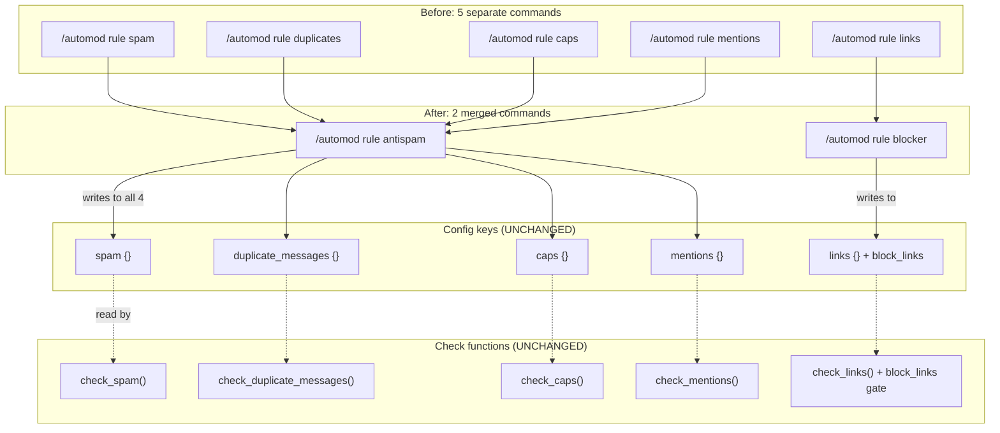

# Automod Rule Consolidation — GPT 5.3 Codex Implementation Spec

> **Target audience:** GPT 5.3 Codex or equivalent AI agent.
> **Goal:** Merge related automod slash commands in `Modules/automod.py` to reduce
> clutter for server admins. Five separate `/automod rule` subcommands become two
> intuitive ones: **antispam** and **blocker**.

---

## 0. Golden Rules

- **Only edit `Modules/automod.py`.** No changes to `Main/Bot.py`, `Modules/tickets.py`,
  or any other file.
- **Do NOT rename or remove any config keys** in `automod.json`. The four internal
  rule keys (`spam`, `duplicate_messages`, `caps`, `mentions`) and the `links` key
  all stay exactly as they are. This is purely a **command-layer** consolidation.
- **Do NOT modify any check functions** (`check_spam`, `check_duplicate_messages`,
  `check_caps`, `check_mentions`, `check_links`). They remain unchanged.
- **Do NOT modify `process_automod()`** or `process_member_join()`. The processing
  pipeline is unaffected.
- **All command responses must use embeds** — never plain text for config commands.
- **All responses must be `ephemeral=True`.**

---

## 1. What Currently Exists (Before)

The `/automod rule` sub-group currently has these **11** subcommands:

| Subcommand | Config key(s) it writes to | Parameters |
|---|---|---|
| `spam` | `spam` | `max_messages:int?` `per_seconds:int?` `timeout_seconds:int?` `action:Choice?` `delete_message:bool?` `enabled:bool?` |
| `duplicates` | `duplicate_messages` | `window_seconds:int?` `min_duplicates:int?` `action:Choice?` `delete_message:bool?` `enabled:bool?` |
| `caps` | `caps` | `min_length:int?` `caps_percent:int?` `action:Choice?` `delete_message:bool?` `enabled:bool?` |
| `mentions` | `mentions` | `max_mentions:int?` `action:Choice?` `delete_message:bool?` `enabled:bool?` |
| `links` | `links` | `block_invites:bool?` `action:Choice?` `delete_message:bool?` `enabled:bool?` |
| `attachments` | `attachments` | *(unchanged)* |
| `newuser` | `new_user` | *(unchanged)* |
| `raid` | `anti_raid` | *(unchanged)* |
| `selfbot` | `anti_selfbot` | *(unchanged)* |
| `regex` | `custom_regex` | *(unchanged)* |
| `set_value` | *(any rule)* | *(unchanged)* |

---

## 2. What It Becomes (After)

| Old subcommand(s) | New subcommand | Config key(s) written |
|---|---|---|
| `spam` + `duplicates` + `caps` + `mentions` | **`antispam`** | `spam`, `duplicate_messages`, `caps`, `mentions` (all four) |
| `links` | **`blocker`** | `links` |

The final `/automod rule` sub-group has **8** subcommands:

```
/automod rule
  antispam       <-- NEW (replaces spam, duplicates, caps, mentions)
  blocker        <-- NEW (replaces links)
  attachments    <-- unchanged
  newuser        <-- unchanged
  raid           <-- unchanged
  selfbot        <-- unchanged
  regex          <-- unchanged
  set_value      <-- unchanged
```

Everything else in the file (`/automod overview`, `/automod warn`, `/automod list`,
`/automod add`, `/automod remove`, `/automod override`, all check functions, the
processing pipeline, etc.) is either unchanged or receives only minor display tweaks
described below.

---

## 3. Config Schema Change

### 3.1 Add `block_links` to default `links` config

In `DEFAULT_GUILD_CONFIG["links"]`, add one new key:

```python
"links": {
    "enabled": True,
    "block_invites": True,
    "block_links": True,          # <-- NEW: controls domain blocking separately
    "allowed_domains": [],
    "allowed_invite_codes": [],
    "action": "delete",
    "delete_message": True,
    "escalation": [],
},
```

**Migration:** Existing `automod.json` files that lack `block_links` automatically
get `True` via the default merge. No migration script is needed.

### 3.2 Add `block_links` to `RULE_SETTING_SPECS`

Update the `"links"` entry in `RULE_SETTING_SPECS` from:
```python
"links": {"block_invites": bool},
```
to:
```python
"links": {"block_invites": bool, "block_links": bool},
```

### 3.3 No other config changes

The four anti-spam config blocks (`spam`, `duplicate_messages`, `caps`, `mentions`)
are **completely unchanged**. No renames, no new keys, no schema changes.

---

## 4. New Constant: `ANTISPAM_RULES`

Add this list right after `RULE_TITLES`:

```python
ANTISPAM_RULES = ["spam", "duplicate_messages", "caps", "mentions"]
```

Used by the overview embed and antispam embed builder to know which rules belong
to the anti-spam group.

---

## 5. Update `RULE_TITLES`

Change the display name for `"links"` from `"Links"` to `"Blocker"`:

```python
RULE_TITLES = {
    ...
    "links": "Blocker",    # was "Links"
    ...
}
```

All other entries stay the same. The internal key names used by check functions
are unaffected.

---

## 6. Update `check_links` to Respect `block_links`

Currently, `check_links` always checks for unapproved domains. Wrap that section
in a `block_links` gate:

**Before:**
```python
urls = [m.group(0) for m in url_re.finditer(message.content or "")]
disallowed = []
for url in urls:
    domain = _extract_domain(url)
    ...
if disallowed:
    return AutomodResult(...)
return None
```

**After:**
```python
block_links = bool(cfg.get("block_links", True))
if block_links:
    urls = [m.group(0) for m in url_re.finditer(message.content or "")]
    disallowed = []
    for url in urls:
        domain = _extract_domain(url)
        ...
    if disallowed:
        return AutomodResult(...)
return None
```

The invite-blocking section above it is **NOT** gated by `block_links` — it uses
the existing `block_invites` key. This gives admins independent toggles:
- `block_invites` = block Discord invite links
- `block_links` = block unapproved domain links

---

## 7. Update `_rule_key_value` for Links

Change the `"links"` branch to show the new `block_links` status:

**Before:**
```python
if rule_name == "links":
    return f"invites={'ON' if cfg.get('block_invites', True) else 'OFF'} domains={len(cfg.get('allowed_domains', []))}"
```

**After:**
```python
if rule_name == "links":
    return (
        f"invites={'ON' if cfg.get('block_invites', True) else 'OFF'} "
        f"links={'ON' if cfg.get('block_links', True) else 'OFF'} "
        f"domains={len(cfg.get('allowed_domains', []))}"
    )
```

---

## 8. New Command: `/automod rule antispam`

### 8.1 Signature

```python
@rule_group.command(name="antispam", description="Configure anti-spam (spam, duplicates, caps, mentions)")
@app_commands.choices(action=ACTION_CHOICES)
async def automod_rule_antispam(
    interaction: discord.Interaction,
    enabled: bool | None = None,
    max_messages: int | None = None,
    per_seconds: int | None = None,
    timeout_seconds: int | None = None,
    min_duplicates: int | None = None,
    dup_window: int | None = None,
    caps_percent: int | None = None,
    caps_min_length: int | None = None,
    max_mentions: int | None = None,
    action: app_commands.Choice[str] | None = None,
    delete_message: bool | None = None,
):
```

### 8.2 Parameter Reference

| Parameter | Type | Writes to config key | Target field | Description |
|---|---|---|---|---|
| `enabled` | `bool?` | `spam`, `duplicate_messages`, `caps`, `mentions` | `enabled` | Master toggle — sets/unsets all four sub-rules at once |
| `max_messages` | `int?` | `spam` | `max_messages` | Messages allowed in window before triggering |
| `per_seconds` | `int?` | `spam` | `per_seconds` | Window size in seconds |
| `timeout_seconds` | `int?` | `spam` | `timeout_seconds` | Timeout duration when action=timeout |
| `min_duplicates` | `int?` | `duplicate_messages` | `min_duplicates` | Identical messages before triggering |
| `dup_window` | `int?` | `duplicate_messages` | `window_seconds` | Lookback window in seconds |
| `caps_percent` | `int?` | `caps` | `caps_percent` | Uppercase % threshold (0-100) |
| `caps_min_length` | `int?` | `caps` | `min_length` | Ignore messages shorter than this |
| `max_mentions` | `int?` | `mentions` | `max_mentions` | Max @user/@role mentions per message |
| `action` | `Choice?` | `spam`, `duplicate_messages`, `caps`, `mentions` | `action` | Shared action for all four sub-rules |
| `delete_message` | `bool?` | `spam`, `duplicate_messages`, `caps`, `mentions` | `delete_message` | Shared delete-triggering-message flag |

### 8.3 Internal Behavior

1. Build a `shared` dict containing `action`, `delete_message`, `enabled` (the three
   params that apply to all four rules).
2. Call `_set_rule_values(guild_id, "spam", {**shared, "max_messages": ..., "per_seconds": ..., "timeout_seconds": ...})`
3. Call `_set_rule_values(guild_id, "duplicate_messages", {**shared, "min_duplicates": ..., "window_seconds": ...})`
4. Call `_set_rule_values(guild_id, "caps", {**shared, "caps_percent": ..., "min_length": ...})`
5. Call `_set_rule_values(guild_id, "mentions", {**shared, "max_mentions": ...})`
6. `_set_rule_values` already skips `None` values, so only explicitly-passed params
   are written. This means:
   - `/automod rule antispam enabled:True` → enables all four rules
   - `/automod rule antispam max_messages:3` → only updates spam's `max_messages`
   - `/automod rule antispam action:Warn caps_percent:80` → updates `action` on
     all four rules AND `caps_percent` on caps
7. Reload guild config and respond with the **Anti-Spam embed** (see 8.4).

### 8.4 Response Embed Layout

```
┌─────────────────────────────────────────────────────┐
│ Title: "Automod: Anti-Spam"                          │
│ Color: GREEN if any sub-rule is enabled, RED if none │
│                                                       │
│ [Field: "Spam" — inline=False]                       │
│   ON | action=timeout                                │
│   5/6s, timeout=60s                                  │
│                                                       │
│ [Field: "Duplicates" — inline=False]                 │
│   OFF | action=delete                                │
│   3 in 30s                                           │
│                                                       │
│ [Field: "Caps" — inline=False]                       │
│   ON | action=delete                                 │
│   70% @ len>=10                                      │
│                                                       │
│ [Field: "Mentions" — inline=False]                   │
│   ON | action=warn                                   │
│   max=5                                              │
└─────────────────────────────────────────────────────┘
```

### 8.5 Embed Builder Function

```python
def _antispam_embed(guild_cfg: dict) -> discord.Embed:
```

- **Input:** Full merged guild config dict (from `get_guild_config(guild_id)`)
- **Output:** `discord.Embed` with the layout above
- Reads from `guild_cfg["spam"]`, `guild_cfg["duplicate_messages"]`,
  `guild_cfg["caps"]`, `guild_cfg["mentions"]`
- Color: `_enabled_color(any_on)` where `any_on` = `any(cfg.get("enabled") for cfg in [spam, dup, caps, ment])`
- Four fields, each `inline=False`:
  - **Spam**: `"{'ON'|'OFF'} | action={action}\n{max_messages}/{per_seconds}s, timeout={timeout_seconds}s"`
  - **Duplicates**: `"{'ON'|'OFF'} | action={action}\n{min_duplicates} in {window_seconds}s"`
  - **Caps**: `"{'ON'|'OFF'} | action={action}\n{caps_percent}% @ len>={min_length}"`
  - **Mentions**: `"{'ON'|'OFF'} | action={action}\nmax={max_mentions}"`

---

## 9. New Command: `/automod rule blocker`

### 9.1 Signature

```python
@rule_group.command(name="blocker", description="Configure invite/domain blocker")
@app_commands.choices(action=ACTION_CHOICES)
async def automod_rule_blocker(
    interaction: discord.Interaction,
    enabled: bool | None = None,
    block_invites: bool | None = None,
    block_links: bool | None = None,
    action: app_commands.Choice[str] | None = None,
    delete_message: bool | None = None,
):
```

### 9.2 Parameter Reference

| Parameter | Type | Writes to config key | Target field | Description |
|---|---|---|---|---|
| `enabled` | `bool?` | `links` | `enabled` | Toggle blocker on/off |
| `block_invites` | `bool?` | `links` | `block_invites` | Block Discord invite links |
| `block_links` | `bool?` | `links` | `block_links` | Block unapproved domain links |
| `action` | `Choice?` | `links` | `action` | Action when triggered |
| `delete_message` | `bool?` | `links` | `delete_message` | Delete the triggering message |

### 9.3 Internal Behavior

1. Call `_set_rule_values(guild_id, "links", {block_invites, block_links, action, delete_message, enabled})`.
2. Respond with the **Blocker embed** (see 9.4).

### 9.4 Response Embed Layout

```
┌─────────────────────────────────────────────────────┐
│ Title: "Automod: Blocker"                            │
│ Color: GREEN if enabled, RED if disabled             │
│                                                       │
│ [Enabled]      [Action]        [Block Invites]       │
│  Yes            delete          Yes                  │
│  (inline)       (inline)        (inline)             │
│                                                       │
│ [Block Links]  [Allowed Domains]  [Allowed Invites]  │
│  Yes            3                  1                  │
│  (inline)       (inline)          (inline)           │
└─────────────────────────────────────────────────────┘
```

### 9.5 Embed Builder Function

```python
def _blocker_embed(cfg: dict) -> discord.Embed:
```

- **Input:** The merged `links` config dict (just the links rule, not the full guild config)
- **Output:** `discord.Embed` with the layout above
- Color: `_enabled_color(enabled)`
- Six fields, all `inline=True`:
  - **Enabled**: "Yes" / "No"
  - **Action**: `cfg.get("action", "n/a")`
  - **Block Invites**: "Yes" / "No" (from `block_invites`)
  - **Block Links**: "Yes" / "No" (from `block_links`)
  - **Allowed Domains**: count of `cfg.get("allowed_domains", [])`
  - **Allowed Invites**: count of `cfg.get("allowed_invite_codes", [])`

---

## 10. Commands to Delete

Remove these five function definitions and their decorators entirely:

| Function name | Decorator | Lines to delete |
|---|---|---|
| `automod_rule_spam` | `@rule_group.command(name="spam", ...)` | The full function |
| `automod_rule_caps` | `@rule_group.command(name="caps", ...)` | The full function |
| `automod_rule_mentions` | `@rule_group.command(name="mentions", ...)` | The full function |
| `automod_rule_duplicates` | `@rule_group.command(name="duplicates", ...)` | The full function |
| `automod_rule_links` | `@rule_group.command(name="links", ...)` | The full function |

**Do NOT delete** `automod_rule_attachments`, `automod_rule_newuser`,
`automod_rule_raid`, `automod_rule_selfbot`, `automod_rule_regex`,
or `automod_rule_set_value`.

---

## 11. Update `/automod overview` Embed

### Before
The overview showed one field per internal rule (11 separate fields), listed linearly.

### After
Group the four anti-spam rules under a single **"Anti-Spam"** field, and the links
rule under a **"Blocker"** field. Remaining rules display individually as before.

**New field order:**

1. `Status` (inline) — ON/OFF
2. `Log Channel` (inline) — #channel or "Not set"
3. **`Anti-Spam`** (inline=False) — grouped summary of spam, duplicates, caps, mentions
4. **`Blocker`** (inline=False) — summary of links/invite/domain blocking
5. `Bad Words` (inline=False) — individual rule
6. `Attachments` (inline=False)
7. `Custom Regex` (inline=False)
8. `Anti Selfbot` (inline=False)
9. `New User` (inline=False)
10. `Anti Raid` (inline=False)

### Anti-Spam field content

```
**Spam**: ON | 5/6s
**Duplicate Messages**: OFF | 3 in 30s
**Caps**: ON | 70% @ len>=10
**Mentions**: ON | max=5
```

Built by iterating `ANTISPAM_RULES` and calling `_rule_title()` and `_rule_key_value()`.

### Blocker field content

```
ON | action=delete
invites=ON links=ON domains=3
```

Built from `guild_cfg["links"]` using `_rule_key_value("links", links_cfg)`.

### Implementation

```python
# Replace the old single loop with:
antispam_lines = []
for rule_name in ANTISPAM_RULES:
    rcfg = guild_cfg.get(rule_name, {})
    status = "ON" if rcfg.get("enabled", False) else "OFF"
    antispam_lines.append(f"**{_rule_title(rule_name)}**: {status} | {_rule_key_value(rule_name, rcfg)}")
embed.add_field(name="Anti-Spam", value="\n".join(antispam_lines), inline=False)

links_cfg = guild_cfg.get("links", {})
embed.add_field(
    name="Blocker",
    value=(
        f"{'ON' if links_cfg.get('enabled', False) else 'OFF'} | "
        f"action={links_cfg.get('action', 'n/a')}\n"
        f"{_rule_key_value('links', links_cfg)}"
    ),
    inline=False,
)

for rule_name in RULE_NAMES + ["anti_raid"]:
    if rule_name in ANTISPAM_RULES or rule_name == "links":
        continue
    # ... existing per-rule field logic unchanged ...
```

---

## 12. What Stays Completely Unchanged

| Component | Why |
|---|---|
| `check_spam()` | Internal check function — not a command |
| `check_duplicate_messages()` | Same |
| `check_caps()` | Same |
| `check_mentions()` | Same |
| `check_links()` | Only gets `block_links` gate added (section 6) |
| `process_automod()` | Pipeline order unchanged |
| `process_member_join()` | Unrelated to this consolidation |
| Config keys: `spam`, `duplicate_messages`, `caps`, `mentions`, `links` | No renames, no removals |
| `RULE_NAMES` list | Check pipeline iterates this — must stay intact |
| `/automod rule attachments` | Not part of merge |
| `/automod rule newuser` | Not part of merge |
| `/automod rule raid` | Not part of merge |
| `/automod rule selfbot` | Not part of merge |
| `/automod rule regex` | Not part of merge |
| `/automod rule set_value` | Advanced escape hatch — stays |
| All `/automod warn` commands | Unrelated |
| All `/automod list` commands | Unrelated |
| All `/automod add` commands | Unrelated |
| All `/automod remove` commands | Unrelated |
| All `/automod override` commands | Unrelated |
| `Main/Bot.py` | Never touched |
| `Modules/tickets.py` | Never touched |
| `automod.json` schema | Only `block_links` added as new default |

---

## 13. Implementation Checklist

Complete in this exact order. Each step should leave the bot in a runnable state.

### Step 1: Config change
- [ ] Add `"block_links": True` to `DEFAULT_GUILD_CONFIG["links"]` (after `"block_invites": True`)
- [ ] Add `"block_links": bool` to `RULE_SETTING_SPECS["links"]`
- [ ] Verify: `python3 -m py_compile Modules/automod.py` passes

### Step 2: Constants
- [ ] Add `ANTISPAM_RULES = ["spam", "duplicate_messages", "caps", "mentions"]` after `RULE_TITLES`
- [ ] Change `RULE_TITLES["links"]` from `"Links"` to `"Blocker"`

### Step 3: Update `check_links`
- [ ] Wrap the domain-checking section in `if bool(cfg.get("block_links", True)):`
- [ ] Do NOT touch the invite-checking section
- [ ] Verify: `python3 -m py_compile Modules/automod.py` passes

### Step 4: Update `_rule_key_value`
- [ ] Add `links={'ON'|'OFF'}` to the links branch output string

### Step 5: Add embed builder functions
- [ ] Add `_antispam_embed(guild_cfg)` function (section 8.5)
- [ ] Add `_blocker_embed(cfg)` function (section 9.5)
- [ ] Place both before `_guild_warns` (around line 950)

### Step 6: Add new commands
- [ ] Add `automod_rule_antispam` (section 8.1) to `rule_group`
- [ ] Add `automod_rule_blocker` (section 9.1) to `rule_group`
- [ ] Place both where the old rule commands were

### Step 7: Delete old commands
- [ ] Delete `automod_rule_spam` function + decorators
- [ ] Delete `automod_rule_caps` function + decorators
- [ ] Delete `automod_rule_mentions` function + decorators
- [ ] Delete `automod_rule_duplicates` function + decorators
- [ ] Delete `automod_rule_links` function + decorators

### Step 8: Update overview embed
- [ ] Replace the single rule loop in `automod_overview` with the grouped layout (section 11)

### Step 9: Validation
- [ ] `python3 -m py_compile Modules/automod.py` passes
- [ ] Bot starts without `CommandLimitReached`
- [ ] `/automod overview` shows "Anti-Spam" and "Blocker" grouped fields
- [ ] `/automod rule antispam enabled:True` enables all four sub-rules and shows combined embed
- [ ] `/automod rule antispam max_messages:3` only updates spam's `max_messages`
- [ ] `/automod rule blocker block_links:False` disables domain blocking but keeps invite blocking
- [ ] Old commands (`/automod rule spam`, `/automod rule links`, etc.) no longer appear

---

## 14. Flowchart



---

## 15. Example Admin Workflows

### "I want to turn off all anti-spam stuff"
```
/automod rule antispam enabled:False
```
Result: All four sub-rules (`spam`, `duplicate_messages`, `caps`, `mentions`) are
disabled in one command. The embed shows all four as OFF.

### "I want to make the spam filter stricter but leave everything else alone"
```
/automod rule antispam max_messages:3 per_seconds:4
```
Result: Only `spam.max_messages` and `spam.per_seconds` change. The other three
sub-rules are untouched. The embed shows the updated spam values alongside the
unchanged duplicates/caps/mentions values.

### "I want to block invites but allow regular links"
```
/automod rule blocker block_invites:True block_links:False
```
Result: Discord invite links are blocked. Non-Discord domain links are allowed
through. The embed shows Block Invites=Yes, Block Links=No.

### "I want to set the action to warn for all anti-spam rules"
```
/automod rule antispam action:Warn
```
Result: `spam.action`, `duplicate_messages.action`, `caps.action`, and
`mentions.action` all become `"warn"`. No other settings change.
